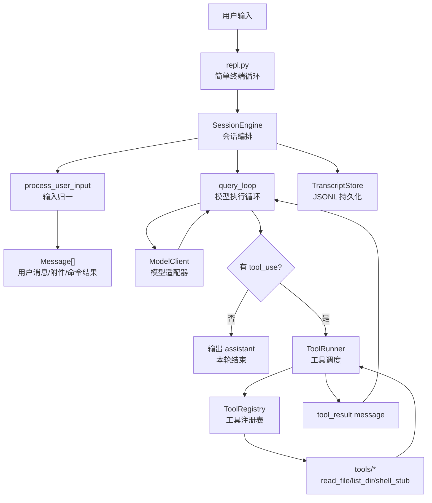
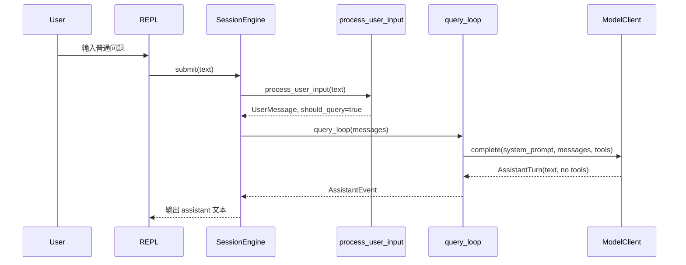
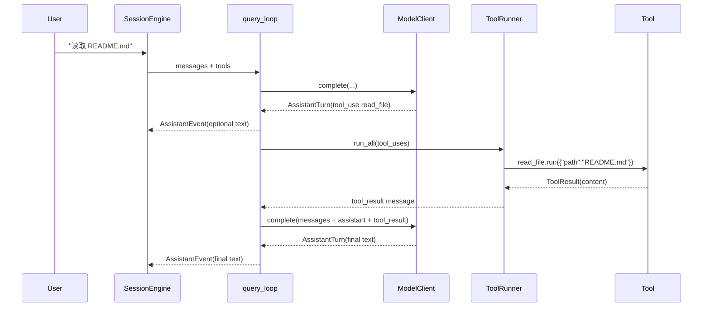

# Python MVP 会话执行链路复刻方案

> 目标：用 Python 复刻当前项目最核心的会话执行链路，做一个能跑通“用户输入 -> 模型响应 -> 工具调用 -> 工具结果回灌 -> 继续模型响应”的最小版本。本文是 MVP 设计方案，不是完整产品实现。

## 1. MVP 边界

这个 MVP 不复刻完整 Claude Code，只复刻会话执行内核。

### 要实现

- 一个简单 REPL：循环读取用户输入并打印 assistant 输出。
- 一个 `SessionEngine`：维护 messages、系统提示、工具列表和会话状态。
- 一个 `query_loop`：调用模型、识别工具调用、执行工具、把 tool result 回灌给模型。
- 一个工具注册系统：支持少量内置工具。
- 一个权限层：MVP 先做静态 allow/deny，不做复杂交互审批。
- 一个 transcript：把消息写入本地 JSONL，方便调试和恢复。

### 暂不实现

- React/Ink 终端 UI。
- MCP、插件、skills、agent swarm、background tasks。
- context collapse、auto compact、microcompact。
- 流式工具提前执行。
- 多模型 provider、OAuth、远程 bridge、LSP、IDE 集成。
- 完整权限策略和用户弹窗。

MVP 的核心价值是验证这条链路：

```text
User input
  -> process_user_input
  -> SessionEngine.submit
  -> query_loop
  -> model_client.stream
  -> tool_use
  -> run_tools
  -> tool_result
  -> query_loop continues
```

## 2. 推荐架构

推荐采用 **同步优先、接口可替换** 的 Python 架构。

原因很直接：MVP 最重要的是把链路跑通，而不是一开始就复刻原项目的复杂异步 UI、并发工具调度和上下文压缩。同步实现更容易调试；接口边界提前设计好，后续可以把模型流、工具执行、REPL 替换成 async 版本。



## 3. 模块设计

建议目录：

```text
python_mvp/
  app/
    __init__.py
    repl.py
    engine.py
    query_loop.py
    messages.py
    input_processor.py
    model_client.py
    tool_registry.py
    tool_runner.py
    permissions.py
    transcript.py
    tools/
      __init__.py
      read_file.py
      list_dir.py
      write_file.py
      shell.py
  tests/
    test_query_loop.py
    test_tool_runner.py
    test_input_processor.py
  pyproject.toml
```

### 3.1 `repl.py`

职责：最小交互入口。

它只做三件事：

- 循环读取用户输入。
- 调用 `SessionEngine.submit(text)`。
- 打印 engine 产生的事件。

MVP 中它不需要 curses、rich TUI 或复杂键盘处理。普通 `input("> ")` 就够了。

### 3.2 `engine.py`

职责：对应原项目的 `QueryEngine.ts`。

核心类：

```python
class SessionEngine:
    def __init__(
        self,
        model_client: ModelClient,
        tools: ToolRegistry,
        transcript: TranscriptStore,
        permission_policy: PermissionPolicy,
        system_prompt: str,
    ): ...

    def submit(self, user_input: str) -> Iterator[EngineEvent]: ...
```

它维护：

- `self.messages`
- `self.system_prompt`
- `self.tool_registry`
- `self.transcript`
- `self.permission_policy`

它负责：

- 调用 `process_user_input`。
- 把用户消息追加到 `messages`。
- 先写 transcript。
- 调用 `query_loop`。
- 把 query 产生的 assistant/tool_result 事件写入 transcript。
- 把事件 yield 给 REPL。

### 3.3 `input_processor.py`

职责：对应原项目的 `processUserInput`。

MVP 只支持三类输入：

| 输入 | 行为 |
|---|---|
| 普通文本 | 生成 user message，进入模型。 |
| `/help` | 本地命令，打印可用命令，不进入模型。 |
| `/clear` | 清空当前会话 messages，不进入模型。 |

后续可以扩展 `/model`、`/tools`、`/save`，但 MVP 先不加。

返回结构：

```python
@dataclass
class ProcessedInput:
    messages: list[Message]
    should_query: bool
    local_output: str | None = None
```

### 3.4 `messages.py`

职责：统一消息结构。

建议用简单 dataclass，不要一开始引入复杂 schema。

```python
@dataclass
class Message:
    role: Literal["system", "user", "assistant", "tool"]
    content: str | list[ContentBlock]
    id: str = field(default_factory=lambda: str(uuid4()))

@dataclass
class ToolUse:
    id: str
    name: str
    input: dict[str, Any]

@dataclass
class AssistantTurn:
    text: str
    tool_uses: list[ToolUse]
```

关键点：MVP 需要能表达 `tool_use` 和 `tool_result`。如果目标模型 API 已经有自己的格式，就在 `model_client.py` 做转换，不要把 provider 格式泄漏到全项目。

### 3.5 `query_loop.py`

职责：对应原项目的 `query.ts`。

MVP 版本保留最核心循环：

```python
def query_loop(
    messages: list[Message],
    system_prompt: str,
    model_client: ModelClient,
    tool_runner: ToolRunner,
    max_turns: int = 8,
) -> Iterator[QueryEvent]:
    for turn in range(max_turns):
        assistant = model_client.complete(
            system_prompt=system_prompt,
            messages=messages,
            tools=tool_runner.tool_schemas(),
        )

        messages.append(assistant.to_message())
        yield AssistantEvent(assistant.text)

        if not assistant.tool_uses:
            return

        for result_msg in tool_runner.run_all(assistant.tool_uses):
            messages.append(result_msg)
            yield ToolResultEvent(result_msg)

    yield ErrorEvent("max_turns reached")
```

MVP 不做上下文压缩。只加 `max_turns`，防止模型反复调用工具导致死循环。

### 3.6 `model_client.py`

职责：隔离模型 API。

定义接口：

```python
class ModelClient(Protocol):
    def complete(
        self,
        system_prompt: str,
        messages: list[Message],
        tools: list[ToolSchema],
    ) -> AssistantTurn:
        ...
```

MVP 可以提供两个实现：

- `FakeModelClient`：用于测试，不访问网络。
- `OpenAIResponsesClient` 或 `AnthropicClient`：真实模型适配器。

如果只是验证链路，先做 `FakeModelClient` 就能跑通工具调用闭环。真实 API 放第二步。

### 3.7 `tool_registry.py`

职责：对应原项目的 `tools.ts`。

核心能力：

- 注册工具。
- 按名字查找工具。
- 导出工具 schema 给模型。

```python
class Tool(Protocol):
    name: str
    description: str

    def schema(self) -> dict[str, Any]: ...
    def run(self, input: dict[str, Any], context: ToolContext) -> ToolResult: ...

class ToolRegistry:
    def register(self, tool: Tool) -> None: ...
    def get(self, name: str) -> Tool | None: ...
    def schemas(self) -> list[dict[str, Any]]: ...
```

### 3.8 `tool_runner.py`

职责：对应原项目的 `toolOrchestration.ts` + `toolExecution.ts` 的最小版。

MVP 流程：

1. 根据 `tool_use.name` 查工具。
2. 如果不存在，返回 error tool_result。
3. 用工具 schema 或手写校验检查 input。
4. 调用 `PermissionPolicy.can_use_tool`。
5. 执行 `tool.run(...)`。
6. 把结果包装成 `tool_result` message。

先串行执行所有工具。并发执行是后续优化。

### 3.9 `permissions.py`

职责：最小权限策略。

MVP 建议三种模式：

```python
class PermissionMode(Enum):
    ALLOW_ALL = "allow_all"
    READ_ONLY = "read_only"
    DENY_ALL = "deny_all"
```

工具可以声明：

```python
class ToolCapability(Enum):
    READ = "read"
    WRITE = "write"
    EXECUTE = "execute"
```

`READ_ONLY` 模式允许 `read_file`、`list_dir`，拒绝 `write_file`、`shell`。

### 3.10 `transcript.py`

职责：最小会话持久化。

用 JSONL：

```json
{"type":"user","message":{...}}
{"type":"assistant","message":{...}}
{"type":"tool_result","message":{...}}
```

MVP 只要求可读、可调试。恢复会话可以作为第二阶段。

## 4. MVP 内置工具

先实现 3 个工具就够了：

| 工具 | 能力 | 风险 | MVP 行为 |
|---|---|---|---|
| `list_dir` | READ | 低 | 列出指定目录下文件名，限制在 workspace 内。 |
| `read_file` | READ | 中 | 读取文本文件，限制大小和 workspace。 |
| `write_file` | WRITE | 高 | 默认禁用，只有 `ALLOW_ALL` 才能写。 |

`shell` 建议 MVP 先不开放真实执行。可以做一个 `shell_stub`，只返回“shell disabled in MVP”。真实 shell 是高风险能力，应该等权限、路径隔离、超时、输出限制设计清楚后再加。

## 5. 数据流细节

### 5.1 普通问答



### 5.2 工具调用



## 6. 最小事件模型

为了让 REPL、测试和未来 Web UI 都能复用，`SessionEngine.submit()` 不直接 `print`，而是 yield 事件。

```python
@dataclass
class AssistantEvent:
    text: str

@dataclass
class ToolUseEvent:
    name: str
    input: dict[str, Any]

@dataclass
class ToolResultEvent:
    name: str
    ok: bool
    preview: str

@dataclass
class ErrorEvent:
    message: str
```

REPL 只负责把这些事件打印出来。

## 7. 错误处理策略

MVP 错误处理要简单但明确：

| 错误 | 处理 |
|---|---|
| 未知工具 | 生成 error tool_result，回给模型。 |
| 工具输入非法 | 生成 error tool_result，回给模型。 |
| 权限拒绝 | 生成 error tool_result，说明权限模式。 |
| 工具执行异常 | 捕获异常，生成 error tool_result。 |
| 模型 API 失败 | 返回 `ErrorEvent`，本轮结束。 |
| 超过 `max_turns` | 返回 `ErrorEvent("max_turns reached")`，防止死循环。 |
| transcript 写入失败 | 打印 warning，但不阻断会话。 |

关键原则：工具错误应该尽量回灌给模型，因为模型可能基于错误修正下一步；模型 API 错误则通常无法继续本轮。

## 8. 测试方案

MVP 的测试重点不是 UI，而是链路闭环。

### 8.1 `test_input_processor.py`

- 普通文本生成 user message。
- `/help` 不进入 query。
- `/clear` 返回清空会话意图。

### 8.2 `test_tool_runner.py`

- 未知工具返回 error tool_result。
- `read_file` 在 READ_ONLY 下允许。
- `write_file` 在 READ_ONLY 下拒绝。
- 工具异常会被包装成 error tool_result。

### 8.3 `test_query_loop.py`

使用 `FakeModelClient`：

- 无工具调用时，一轮结束。
- 有一次工具调用时，执行工具并二次调用模型。
- 连续工具调用超过 `max_turns` 时停止。

### 8.4 `test_engine.py`

- `SessionEngine.submit` 会追加用户消息。
- assistant/tool_result 会写入 transcript。
- local command 不调用模型。

## 9. 迭代计划

### 第 1 步：纯 fake 链路

实现：

- `Message`
- `FakeModelClient`
- `ToolRegistry`
- `ToolRunner`
- `query_loop`
- 一个 `echo_tool`

目标：不访问真实模型，也能证明工具调用闭环能跑。

### 第 2 步：接入真实模型

实现：

- 一个真实 `ModelClient`
- provider 格式和内部 `Message` 的双向转换
- 工具 schema 输出

目标：模型能真的决定调用 `read_file`。

### 第 3 步：文件工具

实现：

- `list_dir`
- `read_file`
- workspace path guard
- 文件大小限制

目标：模型可以读取本地项目上下文。

### 第 4 步：最小 REPL

实现：

- `python -m app.repl`
- `/help`
- `/clear`
- transcript JSONL

目标：人工可以连续对话。

### 第 5 步：安全写工具

实现：

- `write_file`
- 权限模式
- dry-run 或 confirm hook

目标：开始支持改文件，但不默认开放。

## 10. 与原 TypeScript 链路的映射

| TypeScript 项目 | Python MVP |
|---|---|
| `src/screens/REPL.tsx` | `app/repl.py` |
| `processUserInput.ts` | `app/input_processor.py` |
| `QueryEngine.ts` | `app/engine.py` |
| `query.ts` | `app/query_loop.py` |
| `query/deps.ts` | `app/model_client.py` 的接口注入 |
| `tools.ts` | `app/tool_registry.py` |
| `toolOrchestration.ts` | `app/tool_runner.py` 的批处理部分 |
| `toolExecution.ts` | `app/tool_runner.py` 的单工具执行部分 |
| `services/api/claude.ts` | 真实 `ModelClient` 实现 |
| `state/AppStateStore.ts` | MVP 暂用 `SessionEngine` 内部状态 |
| `sessionStorage.ts` | `app/transcript.py` |

## 11. 设计取舍

### 为什么不用复杂 TUI

REPL UI 不是最核心风险。最核心风险是 tool_use 和 tool_result 能否稳定闭环。先用普通 stdin/stdout，能明显降低实现和调试成本。

### 为什么先不用 async

Python async 适合流式 API、并发工具和 WebSocket，但 MVP 阶段会增加心智负担。先同步实现接口，后续把 `ModelClient.complete` 和 `Tool.run` 替换成 async 不会破坏整体架构。

### 为什么不先做 compact

上下文压缩是长会话优化，不是第一版能否跑通的前提。MVP 可以先用 `max_messages` 或 `max_chars` 做粗略截断，等核心链路稳定后再引入 summary compact。

### 为什么不默认开放 shell

shell 是最高风险工具。没有权限、沙箱、超时、输出限制和命令审计前，不应该成为 MVP 默认能力。文件读取工具已经足够验证 agent 工具链路。

## 12. MVP 完成标准

满足下面条件就算 MVP 成功：

- 可以启动一个 Python REPL。
- 用户输入普通问题，模型返回文本。
- 用户请求读取文件，模型发出 `read_file` tool_use。
- ToolRunner 执行 `read_file` 并生成 tool_result。
- query_loop 把 tool_result 发回模型。
- 模型基于文件内容给出最终回答。
- transcript 中能看到 user、assistant、tool_result、assistant 的完整顺序。
- 单元测试覆盖无工具调用、有工具调用、未知工具、权限拒绝、max_turns。

## 13. 最小伪代码

```python
def main():
    registry = ToolRegistry()
    registry.register(ReadFileTool(workspace=Path.cwd()))
    registry.register(ListDirTool(workspace=Path.cwd()))

    engine = SessionEngine(
        model_client=OpenAIResponsesClient.from_env(),
        tools=registry,
        transcript=TranscriptStore(".mvp-session.jsonl"),
        permission_policy=PermissionPolicy(PermissionMode.READ_ONLY),
        system_prompt="You are a coding assistant. Use tools when needed.",
    )

    while True:
        text = input("> ")
        if text in {"exit", "quit"}:
            break

        for event in engine.submit(text):
            print(render_event(event))
```

这个伪代码就是 MVP 的目标形态：入口简单，但内部已经保留了会话编排、模型循环、工具注册、权限和 transcript 的关键边界。

