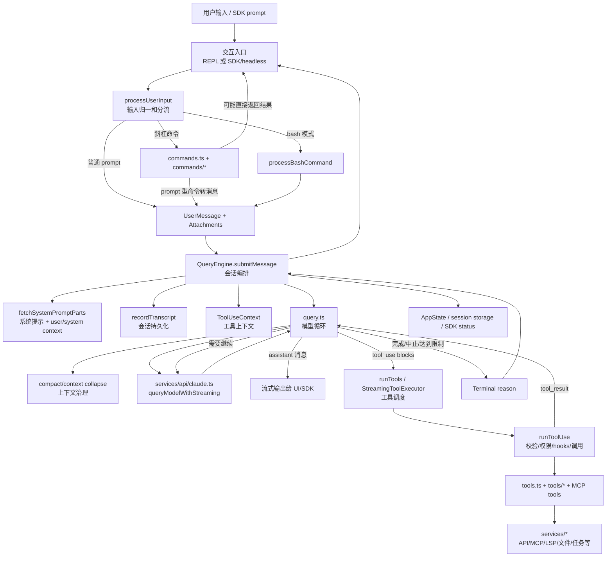
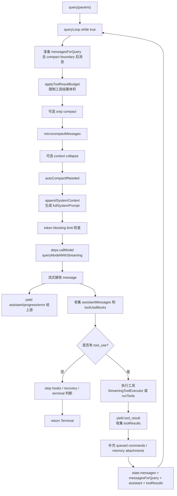
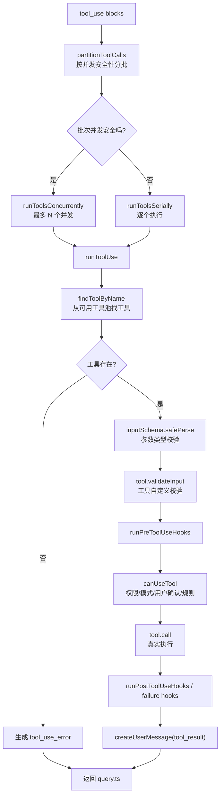
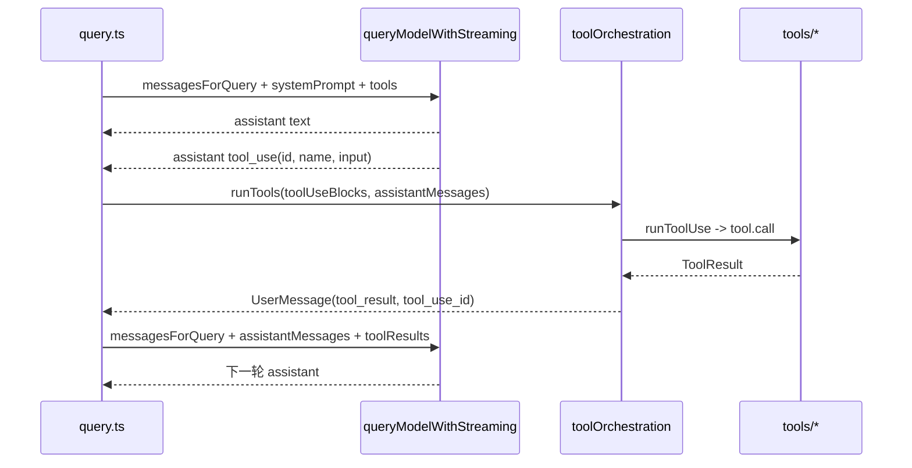

# 会话执行链路重点分析

> 范围：本文只分析项目最核心的会话执行链路，重点展示模块、入口、数据流和模块关系，不深入函数级实现细节。

## 1. 核心结论

这个项目的会话执行链路可以分成 6 层：

| 层级 | 核心模块 | 入口 | 主要职责 |
|---|---|---|---|
| 交互入口层 | REPL / SDK / headless | `src/screens/REPL.tsx`、`src/QueryEngine.ts` | 接收用户输入或外部调用，把一次提交交给会话引擎。 |
| 输入归一层 | processUserInput | `src/utils/processUserInput/processUserInput.ts` | 把原始输入分流成普通 prompt、斜杠命令、bash 命令、附件上下文。 |
| 会话编排层 | QueryEngine | `src/QueryEngine.ts` | 维护一段会话的消息、工具上下文、权限、系统提示、持久化和 AppState 连接。 |
| 模型循环层 | query | `src/query.ts` | 执行模型请求循环、上下文压缩、工具调用续跑、停止条件和恢复策略。 |
| 工具调度层 | toolOrchestration / toolExecution | `src/services/tools/toolOrchestration.ts`、`src/services/tools/toolExecution.ts` | 将模型返回的 tool_use 转换成真实工具执行，并生成 tool_result。 |
| 能力与状态层 | tools / services / state | `src/tools.ts`、`src/services/*`、`src/state/*` | 提供工具池、API/MCP/compact 等服务能力，并保存会话运行状态。 |

一句话看主线：

```text
用户输入
  -> processUserInput 归一化
  -> QueryEngine 组装会话上下文
  -> query.ts 调模型
  -> 模型返回 assistant/tool_use
  -> toolOrchestration 执行工具
  -> tool_result 回灌 messages
  -> query.ts 继续下一轮，直到没有工具调用或被停止
```

## 2. 总览图



## 3. 模块职责关系

### 3.1 REPL / SDK 入口

**代表模块：**

- `src/screens/REPL.tsx`
- `src/replLauncher.tsx`
- `src/QueryEngine.ts`

REPL 是交互式终端入口，SDK/headless 路径可以直接使用 `QueryEngine`。它们的共同点是：最终都需要把“一次用户提交”转换成 `QueryEngine.submitMessage(...)` 可以处理的 prompt 或 content blocks。

REPL 还额外承担 UI 责任，例如输入框、消息列表、状态栏、任务面板、权限弹窗、通知、远程状态展示等。SDK/headless 路径则更重视结构化输出、 transcript 和状态事件。

### 3.2 processUserInput 输入归一层

**入口：** `src/utils/processUserInput/processUserInput.ts`

这个模块是用户输入进入会话前的“分拣台”。它判断输入到底是什么：

| 输入类型 | 处理模块 | 输出 |
|---|---|---|
| 普通文本或 content blocks | `processTextPrompt.ts` | `UserMessage` + 附件消息，`shouldQuery=true` |
| `/xxx` 斜杠命令 | `processSlashCommand.tsx` | 命令执行结果、消息、或 `shouldQuery=false` |
| bash 模式输入 | `processBashCommand.tsx` | 包装后的命令消息或工具相关消息 |
| 图片/粘贴/IDE 选择/附件 | `processUserInput.ts` 内部附件处理 | 附加到用户消息后进入模型上下文 |
| UserPromptSubmit hooks | hooks 子系统 | 可能追加上下文、阻止继续或返回 hook 消息 |

这个层的关键边界是：它不负责模型循环，也不负责真正执行模型工具。它只决定“这次输入要不要进入 query，以及进入 query 的消息长什么样”。

### 3.3 QueryEngine 会话编排层

**入口：** `src/QueryEngine.ts`

`QueryEngine` 是会话执行链路的门面。它把一次用户输入放进已有会话，并准备好 query 需要的一切上下文。

核心职责：

- 持有 `mutableMessages`，让同一个 conversation 可以跨 turn 保留历史。
- 构造系统提示、用户上下文、系统上下文。
- 构造 `ProcessUserInputContext` 和 `ToolUseContext`。
- 调用 `processUserInput`，把输入转换成消息。
- 把用户消息提前写入 transcript，避免请求中途被杀后无法 resume。
- 更新 `AppState.toolPermissionContext` 中由输入产生的 allowed tools。
- 调用 `query(...)` 并消费它产生的流式事件。
- 将 query 产生的消息继续写回 transcript、SDK 输出和内部消息数组。
- 汇总 usage、permission denials、status 等 SDK/headless 需要的状态。

可以把它理解为：

```text
QueryEngine = 会话级上下文管理器 + query.ts 的调用者 + transcript/SDK 适配器
```

### 3.4 query.ts 模型循环层

**入口：** `src/query.ts`

`query.ts` 是真正的“执行循环”。它内部是一个 `while (true)`，每轮做几件事：

1. 从 messages 中取出当前要发给模型的上下文。
2. 执行 tool result budget、snip、microcompact、context collapse、autocompact 等上下文治理。
3. 构造完整 system prompt。
4. 调用 `deps.callModel`，生产环境下就是 `queryModelWithStreaming`。
5. 流式接收 assistant message。
6. 收集 assistant message 中的 `tool_use` block。
7. 如果没有工具调用，进入完成/stop hook/终止处理。
8. 如果有工具调用，执行工具，拿到 `tool_result`。
9. 把 assistant messages 和 tool results 拼回 messages，进入下一轮模型请求。

它的关键状态包括：

| 状态 | 作用 |
|---|---|
| `messages` | 当前循环的会话消息基础。 |
| `messagesForQuery` | 本轮实际发送给模型的消息，可能经过压缩、裁剪或上下文折叠。 |
| `assistantMessages` | 本轮模型流式返回的 assistant 消息集合。 |
| `toolUseBlocks` | 本轮 assistant 消息中发现的工具调用。 |
| `toolResults` | 工具执行后生成的 user/tool_result 消息。 |
| `toolUseContext` | 工具执行需要的上下文和状态更新接口。 |
| `tracking` | autocompact 相关的 turn 计数和失败状态。 |
| `queryTracking` | query chain id 和深度，用于跟踪递归/续跑。 |

## 4. query.ts 内部循环图



## 5. 工具执行链路

工具执行链路分成两层：

| 模块 | 入口 | 职责 |
|---|---|---|
| 调度层 | `runTools` in `src/services/tools/toolOrchestration.ts` | 对多个 tool_use 做并发/串行分批，并维护更新后的 ToolUseContext。 |
| 单工具执行层 | `runToolUse` in `src/services/tools/toolExecution.ts` | 找工具、校验输入、跑 hooks、做权限判断、调用工具、包装 tool_result。 |

调度层根据工具是否 `isConcurrencySafe` 决定执行方式：

- 连续的只读/并发安全工具可以并发执行。
- 非并发安全工具单独串行执行。
- 串行执行时可以立即把 `contextModifier` 应用到后续工具。
- 并发执行时会先收集 context modifier，批次结束后再统一应用，避免并发写上下文造成顺序问题。

### 工具执行图



## 6. API 调用与返回消息

生产环境下，`query.ts` 通过 `query/deps.ts` 注入的 `productionDeps()` 调用模型：

```text
query.ts
  -> deps.callModel(...)
  -> query/deps.ts productionDeps.callModel
  -> services/api/claude.ts queryModelWithStreaming
```

`queryModelWithStreaming` 返回的是异步流。`query.ts` 不等完整响应结束才处理，而是边接收边 yield 给上游。这样 REPL 或 SDK 可以看到流式输出。模型一旦流出 `tool_use` block，`query.ts` 会收集起来；如果启用了 streaming tool execution，还可以在模型流式输出期间就提前启动工具执行。

模型响应大致分三类：

| 返回类型 | query.ts 的处理 |
|---|---|
| 普通 assistant text/thinking | 直接 yield 给 UI/SDK，并放入 `assistantMessages`。 |
| assistant 中的 `tool_use` | 收集到 `toolUseBlocks`，标记需要 follow-up。 |
| API 错误/限制类消息 | 可能先 withheld，等待 context collapse/reactive compact/max-output recovery 是否能恢复。 |

## 7. 消息如何回到下一轮

工具调用不是链路终点。工具执行后，结果会作为新的 user message 里的 `tool_result` block 回到模型上下文。



这个设计遵循 Claude 工具调用协议：模型发出 `tool_use`，客户端执行工具，再把 `tool_result` 用同一个 `tool_use_id` 发回模型。下一轮模型才能基于工具结果继续回答或继续调用工具。

## 8. 关键上下文对象

### 8.1 `ProcessUserInputContext`

这个上下文主要给输入处理阶段使用。它包含当前 messages、命令列表、工具列表、模型配置、MCP clients、AppState getter/setter、abort controller、文件读取缓存、响应长度设置、文件历史/归因状态更新等。

它回答的是：

```text
“这次用户输入该如何变成消息？过程中能访问哪些命令、工具、状态和附件？”
```

### 8.2 `ToolUseContext`

`ToolUseContext` 是工具执行阶段最重要的对象。它把工具执行所需的运行环境集中起来：

- 当前可用工具和命令。
- 当前模型、thinking 配置、MCP clients、MCP resources。
- AppState getter/setter。
- 当前 messages。
- abort controller。
- read file cache。
- in-progress tool ids。
- 文件历史和 attribution 更新接口。
- agentId、queryTracking 等执行追踪字段。

它回答的是：

```text
“模型要求执行某个工具时，这个工具能看到哪些上下文，又能安全地更新哪些状态？”
```

### 8.3 `AppState`

`AppState` 是 REPL/UI 和运行时状态的汇总。会话执行链路重点使用这些区域：

| AppState 区域 | 用途 |
|---|---|
| `toolPermissionContext` | 权限模式、allow/deny rules、额外工作目录。 |
| `mcp` | MCP clients、tools、commands、resources。 |
| `plugins` | 插件启用状态、命令和错误。 |
| `tasks` | 后台任务和 agent 任务状态。 |
| `fileHistory` | 文件读取/编辑历史。 |
| `attribution` | 编辑归因状态。 |
| `todos` | Todo 工具和 agent 的任务列表。 |
| `mainLoopModel` / `effortValue` | 模型和推理强度相关设置。 |

## 9. 会话执行链路中的扩展点

| 扩展点 | 接入位置 | 影响 |
|---|---|---|
| 斜杠命令 | `src/commands.ts` + `src/commands/*` | 用户输入 `/xxx` 时改变消息、状态或直接执行动作。 |
| 模型工具 | `src/tools.ts` + `src/tools/*` | 模型可以通过 `tool_use` 调用真实能力。 |
| MCP 工具 | `src/services/mcp/*` -> `AppState.mcp.tools` -> `tools.ts` | 外部 MCP server 提供的工具并入工具池。 |
| Skills | `src/skills/*` + `SkillTool` + `commands.ts` | prompt 型能力作为命令或模型可选技能出现。 |
| Plugins | `src/utils/plugins/*` | 可提供命令、技能、MCP、agent、hooks、输出样式。 |
| Hooks | `utils/hooks/*`、`services/tools/toolHooks.ts` | 在用户提交、工具执行前后、停止条件等位置插入策略。 |
| Compact | `services/compact/*`、`services/contextCollapse/*` | 控制上下文长度，影响每轮发给模型的消息。 |
| Permission | `hooks/useCanUseTool.ts`、`utils/permissions/*` | 决定工具能否执行、是否询问用户、是否被策略阻止。 |

## 10. 为什么说这是最核心链路

项目其他模块大多服务于这条链路：

- UI 模块负责把输入和输出呈现出来。
- commands/tools/skills/plugins 负责扩展链路能力。
- services/api 负责把 query 发给模型。
- services/compact 负责让长会话还能继续发给模型。
- services/mcp 负责把外部能力并入工具和资源。
- state/bootstrap 负责把运行状态贯穿 REPL、QueryEngine、query 和工具。
- tasks/agent 负责把复杂工具调用变成后台任务或子 agent。

所以从架构上看，真正的“心脏”不是单个文件，而是这条组合链：

```text
processUserInput
  -> QueryEngine
  -> query
  -> queryModelWithStreaming
  -> runTools/runToolUse
  -> tool_result 回到 query
```

其中最关键的两个文件仍然是：

- `src/QueryEngine.ts`：会话门面和上下文编排。
- `src/query.ts`：模型请求、工具调用和续跑循环的内核。

