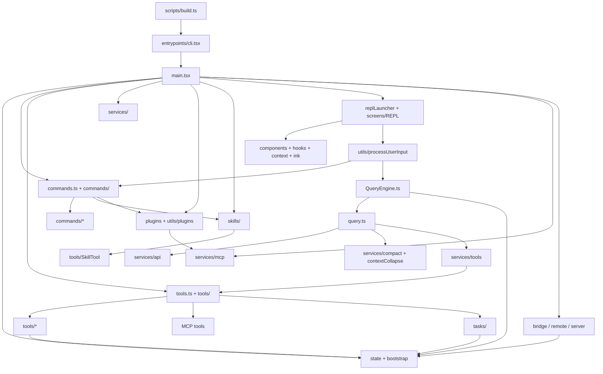

# free-code 项目结构分析

> 分析目标：结合源码梳理项目有哪些模块、每个模块的入口、模块之间的关系。本文只做结构级说明，不深入函数实现细节。

## 1. 项目快速概览

这是一个基于 Bun + TypeScript + React/Ink 的命令行应用源码快照，包名为 `claude-code-source-snapshot`。项目核心形态是一个可交互 CLI：用户通过终端 REPL 输入自然语言、斜杠命令或工具请求，系统再把输入转换成会话消息、模型请求、工具调用和终端 UI 更新。

从 `package.json` 可以看到主要运行入口：

| 场景 | 命令 | 入口 |
|---|---|---|
| 开发运行 | `bun run dev` | `src/entrypoints/cli.tsx` |
| 标准构建 | `bun run build` | `scripts/build.ts` 打包 `src/entrypoints/cli.tsx` |
| 开发构建 | `bun run build:dev` | `scripts/build.ts --dev` |
| 完整实验特性构建 | `bun run build:dev:full` | `scripts/build.ts --dev --feature-set=dev-full` |
| 编译输出 | `bun run compile` | `scripts/build.ts --compile` |

源码规模较大，`src` 下有三十多个一级模块，其中 `utils`、`components`、`commands`、`tools`、`services` 是文件数量最多的区域。整体架构可以理解为：

```text
CLI 启动层
  -> 应用初始化层
    -> 终端 UI / 非交互入口
      -> 输入处理与命令系统
      -> QueryEngine 会话引擎
        -> query 流式模型循环
          -> API / compact / tools / MCP / hooks / state
```

## 2. 顶层目录地图

| 路径 | 类型 | 职责摘要 |
|---|---|---|
| `src/entrypoints/` | 入口层 | CLI、MCP、SDK 等进程入口，负责快路径判断和加载主程序。 |
| `src/main.tsx` | 主启动编排 | 初始化配置、认证、MCP、插件、技能、工具、命令、状态和 REPL。 |
| `src/screens/` | 页面层 | 终端交互页面，最关键的是 `REPL.tsx`。 |
| `src/components/` | UI 组件层 | Ink/React 终端组件、对话框、状态栏、任务面板、插件/代理界面。 |
| `src/ink/` | 终端渲染基础设施 | 本项目内置或改造的 Ink 渲染、布局、输入、事件、终端能力检测。 |
| `src/hooks/` | React hooks | REPL 和组件使用的交互、状态、插件、任务、IDE、通知等 hooks。 |
| `src/context/` | React context | UI 层共享上下文，例如通知、模态框、统计、消息队列。 |
| `src/commands.ts` | 命令注册中心 | 汇总内置命令、技能命令、插件命令、工作流命令并过滤可用命令。 |
| `src/commands/` | 命令实现 | `/login`、`/mcp`、`/plugin`、`/review`、`/memory` 等斜杠命令实现。 |
| `src/tools.ts` | 工具注册中心 | 汇总内置工具、MCP 工具、权限过滤和工具池组装。 |
| `src/tools/` | 工具实现 | Agent、Bash、Read、Edit、WebFetch、Todo、MCP、Task 等模型可调用工具。 |
| `src/QueryEngine.ts` | 会话引擎 | 管理单轮或多轮查询的消息、工具上下文、权限、会话持久化和 SDK 输出。 |
| `src/query.ts` | 模型请求循环 | 处理模型流式响应、自动压缩、工具执行、停止 hooks、预算和重试路径。 |
| `src/query/` | 查询辅助模块 | query 的配置、依赖注入、停止 hooks、token budget 等。 |
| `src/services/` | 服务层 | API、MCP、OAuth、插件服务、compact、LSP、遥测、设置同步、内存等子系统。 |
| `src/state/` | 应用状态 | AppState、store、状态变化回调。 |
| `src/bootstrap/` | 启动全局状态 | session、cwd、模式、SDK beta、渠道等启动期全局状态。 |
| `src/skills/` | 技能系统 | bundled skills、用户技能目录加载、技能命令生成。 |
| `src/plugins/` | 内置插件入口 | 注册内置插件和内置插件技能。 |
| `src/utils/plugins/` | 插件实现工具 | 插件加载、缓存、安装、市场、策略、MCP 集成、命令/技能/agent 加载。 |
| `src/bridge/` | 远程桥接 | 本地 REPL 与远程控制/Claude.ai 会话之间的桥接。 |
| `src/remote/` | 远程会话 | remote session manager、WebSocket、权限桥接和 SDK 消息适配。 |
| `src/server/` | 本地服务 | direct connect/session server 相关类型和连接管理。 |
| `src/cli/` | 非交互 CLI 辅助 | 结构化输出、打印、远程 IO、部分子命令 handler。 |
| `src/tasks/` | 后台任务 | 本地/远程 agent task、任务状态、进度和停止逻辑。 |
| `src/assistant/` | assistant 模式 | assistant 会话选择和会话历史。 |
| `src/buddy/` | companion UI | companion sprite、提示和通知。 |
| `src/keybindings/` | 快捷键系统 | 默认绑定、用户绑定加载、解析、匹配和 Provider。 |
| `src/vim/` | Vim 输入模式 | motions、operators、text objects、状态转换。 |
| `src/memdir/` | 内存目录 | 记忆文件路径、加载和相关逻辑。 |
| `src/migrations/` | 配置迁移 | 模型、设置、远程控制等历史配置迁移。 |
| `src/native-ts/` | 原生能力 TS 封装 | 文件索引、Yoga layout 等本地/替代实现。 |
| `src/constants/` | 常量 | 系统提示、工具限制、OAuth、产品、API 限额等常量。 |
| `src/types/` | 通用类型 | 权限、hooks、plugin、日志、id 等类型。 |
| `scripts/` | 构建脚本 | `build.ts` 负责 feature flag、define、Bun compile 输出。 |
| `assets/` | 静态资源 | README 使用的截图等资源。 |

## 3. 核心模块与入口

### 3.1 CLI 启动模块

**入口：** `src/entrypoints/cli.tsx`

这个文件是构建和开发运行的第一入口。它先处理低成本快路径，例如 `--version`、`--dump-system-prompt`、Chrome native host、bridge/daemon 等特殊模式；普通路径最后动态导入 `src/main.tsx`。这样做的主要原因是 CLI 对启动速度敏感，很多分支不需要加载完整 React UI、模型配置和服务层。

**下游关系：**

- 普通交互模式进入 `src/main.tsx`。
- MCP 子模式进入 `src/entrypoints/mcp.ts` 或相关工具入口。
- bridge/daemon/remote-control 等 feature-gated 路径进入 `src/bridge`、`src/server` 或对应 handler。

### 3.2 主程序编排模块

**入口：** `src/main.tsx`

`main.tsx` 是实际应用启动编排中心。它负责读取 CLI 参数、应用配置和环境变量，初始化模型、权限、MCP、插件、技能、工具、命令、状态 store、React/Ink 渲染上下文，并根据模式选择交互 REPL、非交互输出、MCP/server/remote 等路径。

**关键下游：**

- `src/commands.ts`：加载斜杠命令。
- `src/tools.ts`：加载模型工具。
- `src/replLauncher.tsx` 和 `src/screens/REPL.tsx`：启动交互 UI。
- `src/QueryEngine.ts`：处理用户输入后的模型会话。
- `src/services/*`：API、MCP、认证、设置、插件等服务能力。
- `src/state/*`：创建和维护 AppState。

### 3.3 REPL 交互模块

**入口：**

- `src/replLauncher.tsx`
- `src/screens/REPL.tsx`

`replLauncher.tsx` 是薄入口，负责把 App 外壳和 REPL 组件挂到 Ink root。`REPL.tsx` 是交互主屏：显示消息列表、输入框、状态栏、任务、权限提示、插件状态、远程状态等，并把用户输入交给输入处理模块和 QueryEngine。

**上游关系：** `main.tsx` 初始化完成后调用 REPL。

**下游关系：**

- 调用 `utils/processUserInput/*` 判断输入类型。
- 调用 `QueryEngine` 发起模型请求。
- 使用 `components`、`hooks`、`context`、`state` 维护终端交互体验。

### 3.4 输入处理模块

**入口：** `src/utils/processUserInput/processUserInput.ts`

输入处理模块把用户在 REPL 里输入的内容分流为几类：

- 普通自然语言提示：进入 `processTextPrompt.ts`，最终变成用户消息。
- 斜杠命令：进入 `processSlashCommand.tsx`，查找 `commands.ts` 汇总出的命令。
- Bash 风格输入：进入 `processBashCommand.tsx`。

它处在 UI 与会话引擎之间，是“用户文本”变成“系统可执行动作”的第一道分发层。

### 3.5 命令系统

**注册入口：** `src/commands.ts`  
**实现目录：** `src/commands/`

命令系统负责 `/login`、`/mcp`、`/plugin`、`/memory`、`/review`、`/compact`、`/doctor` 等终端斜杠命令。

`commands.ts` 的职责不是实现每个命令，而是做命令汇总与过滤：

- 汇总内置命令。
- 汇总用户技能目录产生的命令。
- 汇总 bundled skills。
- 汇总插件命令。
- 汇总工作流命令。
- 根据认证状态、provider、feature flag、命令 `isEnabled()` 过滤。
- 把满足条件的 prompt 型命令暴露给 SkillTool 或 slash command 处理。

**模块关系：**

```text
REPL 输入
  -> processSlashCommand
    -> commands.ts/getCommands
      -> commands/*
      -> skills/*
      -> plugins / utils/plugins/*
      -> WorkflowTool command adapter
```

### 3.6 工具系统

**注册入口：** `src/tools.ts`  
**实现目录：** `src/tools/`

工具系统负责模型可调用的工具池，例如 `AgentTool`、`BashTool`、`FileReadTool`、`FileEditTool`、`WebFetchTool`、`WebSearchTool`、`TodoWriteTool`、`SkillTool`、`MCPTool`、`Task*Tool` 等。

`tools.ts` 的主要职责：

- 定义所有可能可用的内置工具。
- 根据环境变量、feature flag、用户类型、权限模式启用或禁用工具。
- 根据 deny rules 过滤工具。
- 把内置工具和 MCP 工具合并成最终工具池。
- 保持内置工具排序稳定，减少系统提示缓存失效。

**模块关系：**

```text
main.tsx / QueryEngine
  -> tools.ts/getTools 或 assembleToolPool
    -> tools/*
    -> services/mcp 提供的 MCP tools
    -> utils/permissions 做权限过滤
```

### 3.7 QueryEngine 会话模块

**入口：** `src/QueryEngine.ts`

`QueryEngine` 是对一次会话/一次用户提交的高层封装。它接收 messages、tools、commands、MCP clients、agents、权限函数、AppState getter/setter 等配置，然后组织消息、上下文、系统提示、持久化、文件快照、权限和 SDK 兼容输出。

它不直接等同于模型 API 调用，而是把 UI/SDK 层的复杂上下文整理好，再调用更底层的 `query.ts`。

**上游关系：**

- REPL 交互路径。
- SDK/headless 路径。
- Agent 或后台任务路径。

**下游关系：**

- `src/query.ts`：真正的流式 query loop。
- `services/api/*`：模型 API。
- `services/compact/*`：上下文压缩。
- `utils/processUserInput/*`：必要时处理 replay 或命令输入。
- `utils/sessionStorage.ts` 等会话持久化工具。

### 3.8 query 流式模型循环

**入口：** `src/query.ts`

`query.ts` 是模型请求和工具调用的核心循环。它接收已整理好的消息、系统提示、用户上下文、工具上下文和权限函数，然后执行：

- 上下文裁剪、microcompact、autocompact、context collapse。
- 构建请求配置。
- 发起流式模型请求。
- 识别模型返回的工具调用。
- 调用 `services/tools/toolOrchestration` 执行工具。
- 处理工具结果、停止 hooks、重试、预算和终止状态。

结构上，`QueryEngine.ts` 更像“会话门面”，`query.ts` 更像“模型执行循环”。

### 3.9 服务层

**入口目录：** `src/services/`

服务层是项目的后端能力集合，包含多个独立子系统：

| 子模块 | 入口/代表文件 | 职责 |
|---|---|---|
| API | `src/services/api/` | Claude/API 请求、bootstrap、files、errors、logging 等。 |
| MCP | `src/services/mcp/` | MCP client、config、OAuth、headers、资源、工具与命令接入。 |
| compact | `src/services/compact/` | 自动压缩、手动 compact、snip/reactive compact 等上下文治理。 |
| tools | `src/services/tools/` | 工具执行编排、流式工具执行、工具结果摘要。 |
| plugins | `src/services/plugins/` | 插件 CLI 操作、安装管理、插件服务层命令。 |
| analytics | `src/services/analytics/` | GrowthBook、事件、sink；该 fork 的 README 表示遥测相关已做清理/替换。 |
| lsp | `src/services/lsp/` | LSP server/client、诊断注册和被动反馈。 |
| oauth | `src/services/oauth/` | OAuth 相关流程。 |
| remoteManagedSettings | `src/services/remoteManagedSettings/` | 远程管理设置同步和安全检查。 |
| SessionMemory | `src/services/SessionMemory/` | 会话记忆提取、提示和状态。 |
| teamMemorySync | `src/services/teamMemorySync/` | 团队记忆同步和 secret guard。 |
| PromptSuggestion | `src/services/PromptSuggestion/` | 输入建议。 |
| toolUseSummary | `src/services/toolUseSummary/` | 工具使用摘要生成。 |

### 3.10 状态模块

**入口：**

- `src/state/AppStateStore.ts`
- `src/state/store.ts`
- `src/bootstrap/state.ts`

`state/store.ts` 提供轻量 store：`getState`、`setState`、`subscribe`。`AppStateStore.ts` 定义应用运行态结构，包括设置、模型、MCP、插件、任务、agent、文件历史、权限、通知、远程 bridge 状态等。`bootstrap/state.ts` 保存启动期和会话级全局状态，例如 cwd、session id、client type、是否交互模式等。

**模块关系：**

```text
main.tsx 创建 store
  -> REPL / components / hooks 读取和更新 AppState
  -> QueryEngine 通过 getAppState/setAppState 访问状态
  -> tools 和 tasks 在执行过程中更新部分状态
```

### 3.11 UI 与终端渲染模块

**入口：**

- `src/ink.ts`
- `src/ink/`
- `src/components/`
- `src/hooks/`
- `src/context/`

这个项目不是普通 Node CLI，而是 React/Ink 风格的终端应用。UI 分成两层：

- `src/ink/`：更底层的终端渲染、布局、事件、输入、文本宽度、ANSI 处理。
- `src/components/`：业务 UI 组件，例如消息列表、状态栏、权限弹窗、插件对话框、任务视图、模型选择器等。

`hooks` 与 `context` 是 UI 状态和交互复用层，为 REPL 和组件提供键盘、任务、插件、IDE、通知、远程连接等能力。

### 3.12 技能系统

**入口：**

- `src/skills/loadSkillsDir.ts`
- `src/skills/bundledSkills.ts`
- `src/skills/bundled/`
- `src/tools/SkillTool/SkillTool.ts`

技能系统把 Markdown 技能文件或 bundled skill 转换成 prompt 型命令，再由命令系统和 SkillTool 暴露给模型使用。

**关系：**

```text
skills/loadSkillsDir.ts
  -> 读取用户技能目录
  -> createSkillCommand
  -> commands.ts/getCommands
  -> SkillTool 或 slash command 使用
```

### 3.13 插件系统

**入口：**

- `src/plugins/bundled/index.ts`
- `src/plugins/builtinPlugins.ts`
- `src/utils/plugins/pluginLoader.ts`
- `src/commands/plugin/index.tsx`
- `src/services/plugins/pluginCliCommands.ts`

插件系统负责加载插件定义、插件命令、插件技能、插件 MCP server、插件 agent 和插件输出样式。用户侧入口主要是 `/plugin` 命令；启动侧入口是 `main.tsx` 初始化插件，再把结果合并进 AppState、命令系统和 MCP 系统。

### 3.14 MCP 模块

**入口：**

- `src/entrypoints/mcp.ts`
- `src/services/mcp/client.ts`
- `src/services/mcp/config.ts`
- `src/tools/MCPTool/`
- `src/tools/ListMcpResourcesTool/`
- `src/tools/ReadMcpResourceTool/`

MCP 在项目里有两种角色：

1. 本程序可以作为 MCP server 暴露自身工具，入口是 `src/entrypoints/mcp.ts`。
2. 本程序也可以作为 MCP client 连接外部 MCP server，入口集中在 `src/services/mcp/`，最终把外部工具、命令、资源合并进 AppState 和工具池。

### 3.15 Bridge、Remote 与 Server 模块

**入口：**

- `src/bridge/bridgeMain.ts`
- `src/bridge/initReplBridge.ts`
- `src/remote/RemoteSessionManager.ts`
- `src/server/createDirectConnectSession.ts`
- `src/server/directConnectManager.ts`

这组模块负责远程控制、远程 session、direct connect、WebSocket 通信和权限桥接。它们不是普通本地 REPL 的必经路径，但会在 remote/bridge feature 或相关 CLI 参数启用时参与启动。

### 3.16 任务与 Agent 模块

**入口：**

- `src/tasks/LocalAgentTask/LocalAgentTask.tsx`
- `src/tasks/RemoteAgentTask/RemoteAgentTask.tsx`
- `src/tools/AgentTool/AgentTool.ts`
- `src/tools/TaskCreateTool/`、`TaskGetTool/`、`TaskUpdateTool/`、`TaskListTool/`

任务系统管理后台 agent、本地/远程任务、任务进度、任务通知和停止逻辑。AgentTool 是模型侧创建或调用 agent 的关键工具，任务状态会进入 AppState，并由 REPL 的任务 UI 展示。

### 3.17 构建与 Feature Flag 模块

**入口：** `scripts/build.ts`

构建脚本通过 Bun build/compile 打包 `src/entrypoints/cli.tsx`，并通过 `--feature`、`--feature-set=dev-full` 传入 feature flags。源码里大量使用 `feature('FLAG')`，构建时可以让某些命令、工具、服务路径被保留或消除。

## 4. 主调用链

### 4.1 普通交互模式

```text
package.json: bun run dev
  -> src/entrypoints/cli.tsx
    -> src/main.tsx
      -> 初始化配置 / 认证 / 设置 / MCP / 插件 / 技能
      -> src/commands.ts 生成命令列表
      -> src/tools.ts 生成工具列表
      -> src/state/store.ts 创建 AppState store
      -> src/replLauncher.tsx
        -> src/screens/REPL.tsx
          -> 用户输入
            -> src/utils/processUserInput/processUserInput.ts
              -> 普通 prompt / slash command / bash command 分流
            -> src/QueryEngine.ts
              -> src/query.ts
                -> services/api 发起模型请求
                -> services/tools 执行工具
                -> state/components 更新 UI
```

### 4.2 斜杠命令路径

```text
REPL 输入 "/xxx"
  -> processSlashCommand.tsx
    -> commands.ts/getCommands(cwd)
      -> built-in commands
      -> skill commands
      -> plugin commands
      -> workflow commands
    -> 执行匹配命令
      -> 可能更新 AppState、调用服务、打开 UI 对话框或返回 prompt 消息
```

### 4.3 模型工具调用路径

```text
QueryEngine
  -> query.ts 流式读取 assistant 响应
    -> 发现 tool_use
      -> services/tools/toolOrchestration
        -> tools.ts/assembleToolPool 得到工具
        -> permissions 判断能否调用
        -> tools/<ToolName>/<ToolName>.ts 执行
      -> tool_result 写回 messages
      -> query.ts 继续下一轮模型请求
```

### 4.4 MCP 外部工具路径

```text
main.tsx
  -> services/mcp/config.ts 读取 MCP 配置
  -> services/mcp/client.ts 建立连接
  -> AppState.mcp.tools / commands / resources
  -> tools.ts 合并 MCP tools
  -> commands.ts 或 SkillTool 合并 MCP prompt commands
```

### 4.5 插件路径

```text
main.tsx
  -> plugins/bundled/index.ts 初始化内置插件
  -> utils/plugins/pluginLoader.ts 加载插件缓存
  -> utils/plugins/loadPluginCommands.ts 加载插件命令
  -> skills / commands / MCP / agents / outputStyles 各自接入
  -> AppState.plugins 保存插件状态和错误
```

## 5. 模块关系总图



## 6. 重要模块边界说明

### `commands` 与 `tools` 的边界

`commands` 面向用户主动输入，典型形式是 `/login`、`/mcp`、`/plugin`。`tools` 面向模型调用，典型形式是读文件、改文件、执行 shell、发起 agent、读取 MCP 资源。两者都会进入会话上下文，但触发者不同：命令由用户显式触发，工具由模型在 query loop 中触发。

### `QueryEngine.ts` 与 `query.ts` 的边界

`QueryEngine.ts` 管“会话上下文怎么组织”，包括消息、命令、工具、AppState、权限、持久化和 SDK 兼容。`query.ts` 管“模型循环怎么跑”，包括请求、流式响应、工具调用、压缩、预算、hooks 和重试。

### `services` 与 `utils` 的边界

`services` 更像可命名的业务子系统，例如 API、MCP、compact、plugins、LSP、SessionMemory。`utils` 更像跨模块基础工具箱，例如路径、配置、权限、消息、模型、sessionStorage、插件加载细节、shell、git、telemetry helper 等。实际项目中 `utils` 很大，说明这里承载了不少基础设施和历史沉淀。

### `plugins` 与 `skills` 的边界

`skills` 是模型能力扩展，最终大多表现为 prompt 型命令或 SkillTool 可调用能力。`plugins` 是更大的扩展单元，可以带命令、技能、MCP server、agent、hooks、输出样式等。也就是说，技能是插件可以提供的一类能力，但插件不只提供技能。

### `ink/components/hooks/context` 的边界

`ink` 是终端渲染底座，`components` 是业务组件，`hooks` 是组件逻辑复用，`context` 是 React 共享上下文。REPL 是它们的主要消费方。

## 7. 外部依赖按模块归类

| 依赖类别 | 代表依赖 | 主要使用模块 |
|---|---|---|
| 运行时与构建 | `bun`、`typescript` | `scripts/build.ts`、所有 TS/TSX 源码 |
| CLI 参数 | `@commander-js/extra-typings` | `main.tsx`、CLI 子命令 |
| 终端 UI | `react`、`ink`、`chalk`、`figures`、`wrap-ansi` | `screens`、`components`、`ink` |
| Anthropic/API | `@anthropic-ai/sdk`、`@anthropic-ai/bedrock-sdk`、`@anthropic-ai/vertex-sdk` | `services/api`、模型/provider 工具 |
| MCP | `@modelcontextprotocol/sdk`、`@anthropic-ai/mcpb` | `entrypoints/mcp.ts`、`services/mcp`、`tools/MCPTool` |
| 云认证 | `@aws-sdk/*`、`@azure/identity`、`google-auth-library` | provider、OAuth、Bedrock/Vertex/Foundry 相关路径 |
| 校验与解析 | `zod`、`yaml`、`jsonc-parser`、`ajv` | 配置、schema、SDK、MCP、插件 |
| 文件/进程/网络 | `execa`、`undici`、`ws`、`chokidar`、`proper-lockfile` | shell、MCP、远程、文件监听、插件 |
| 文本处理 | `marked`、`turndown`、`highlight.js`、`strip-ansi`、`diff` | Markdown、WebFetch、代码高亮、diff UI |

## 8. 测试与验证入口观察

本次结构扫描未发现常见测试文件模式，例如 `*.test.ts`、`*.spec.ts`、`*_test.ts`。项目验证入口主要体现在：

- `package.json` 的 build/dev/compile 脚本。
- `scripts/build.ts` 的构建流程。
- `src/commands/doctor/` 这类运行时诊断命令。
- 若干 feature-gated 或内部命令，如 review、安全审查、debug-tool-call 等。

这意味着从仓库结构看，项目更像“可构建源码快照”，而不是带完整单元测试套件的开发仓库。

## 9. 建议阅读顺序

如果只是理解结构，推荐按下面顺序读：

1. `package.json`：确认运行入口和依赖。
2. `scripts/build.ts`：理解 feature flag 和构建产物。
3. `src/entrypoints/cli.tsx`：理解进程入口和快路径。
4. `src/main.tsx`：理解应用启动时组装了哪些系统。
5. `src/commands.ts`：理解斜杠命令来源。
6. `src/tools.ts`：理解模型工具来源。
7. `src/screens/REPL.tsx`：理解交互 UI 如何承接用户输入。
8. `src/utils/processUserInput/processUserInput.ts`：理解输入分流。
9. `src/QueryEngine.ts`：理解会话封装。
10. `src/query.ts`：理解模型循环和工具执行链路。
11. 根据需要再进入 `services/mcp`、`utils/plugins`、`skills`、`tasks`、`bridge` 等子系统。

## 10. 一句话总结

这个项目的中心不是某个单独算法，而是一套 CLI agent 运行时：`entrypoints/cli.tsx` 负责启动，`main.tsx` 负责组装系统，`REPL.tsx` 负责终端交互，`commands.ts` 和 `tools.ts` 提供扩展点，`QueryEngine.ts` 与 `query.ts` 负责把用户输入、模型响应和工具执行组织成完整会话。
